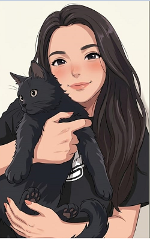

# Programación con objetos I
## Presentación Personal

### Datos Personales
Mi nombre es Rocio, vivo en Ituzaingó tengo 36 años, a los 16 me diagnosticaron una enfermedad inmunológica (de esas que tiene uno en un millón), tuve una hija a los 17, me case a los 19 y me separe a los 32, en el medio tabajé como mesera en cumpleaños, me mude a Rio Grande (Provincia de Tierra del Fuego), hice un secretariado, me anote en un profesorado para maestra jardinera (después de un año y medio de cursada lo tuve que dejar porque volví a Buenos Aires), me recibí de Técnica Universitaria en Seguridad e Higiene en la UTN, trabaje para una consultora, tres meses antes de la pandemia trabaje en una fiambrería/dietética, en pandemia me anote en el Argentina Programa (llegando al último examen me di cuenta que no alcanzaba así que por ese motivo me anote a la Técnicatura en Programación, actualmente cursando el segundo año), después me recibí de Licenciada en Seguridad e Higiene en la facultad de Lomas; actualmente trabajo hace 5 años para una empresa haciendo todo menos seguridad e higiene, por el otro lado también trabajo en la consultora familiar haciendo gestión y planos con AUTOCAD.  

### Otra Información
- Este es mi primer contacto con github.
- Tengo dos gatos, Toulouse (como el de los Aristogatos) y la Negra.
- Amo leer, tocar el piano y el violín.
- Me encanta el anime y el k-pop.
- Me defiendo con varios idiomas Inglés, Italiano, Portugues y Frances, pero ninguno completamente desarrollado, es un pendiente. 
